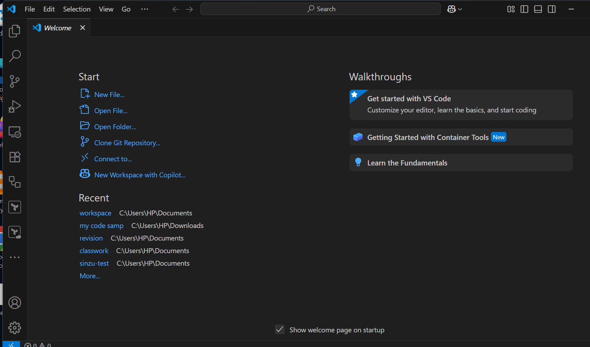
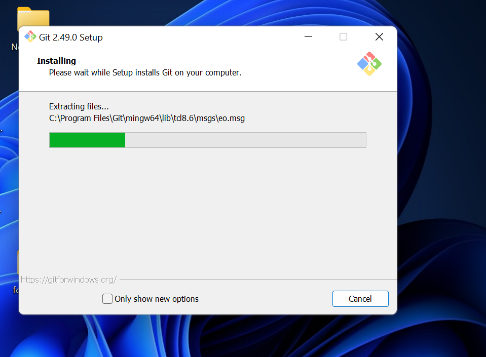
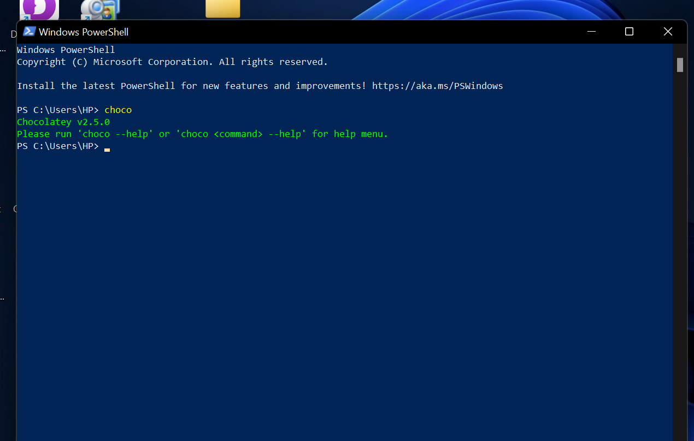
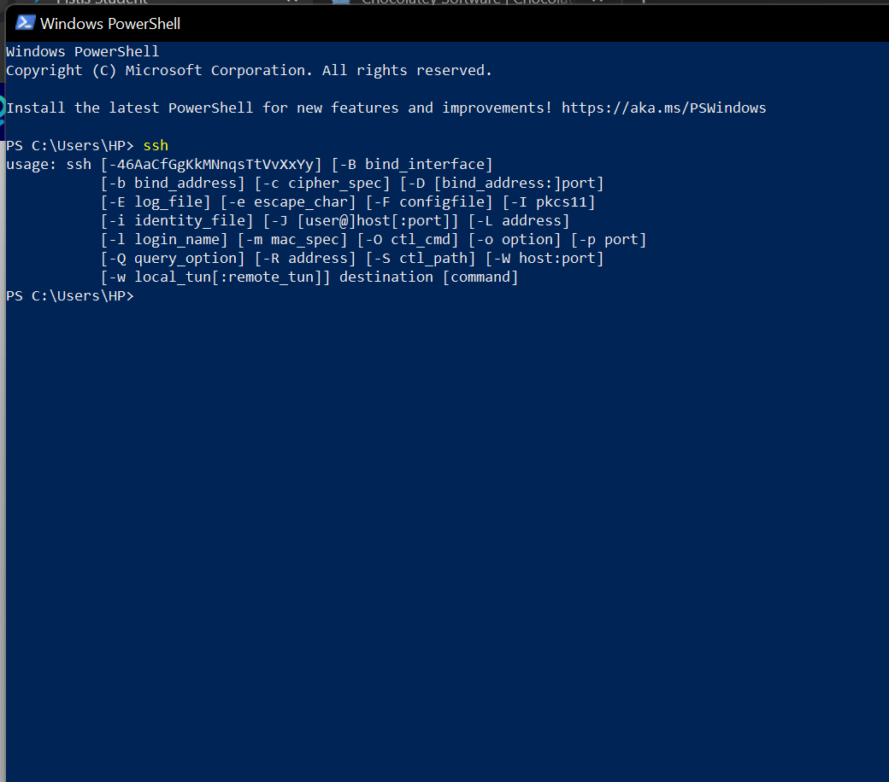

# Vscode isntalltion steps
Go to the official website: https://code.visualstudio.com/

Click on Download for Windows (usually auto-detected).

Run the Installer:

Open the downloaded .exe file.

Accept the license agreement, then click Next.

Choose Installation Location:

Select a destination folder (or leave it as default), click Next.

Select Additional Tasks:

✅ Add to PATH (important for running code from terminal)

✅ Register Code as an editor for supported file types

✅ Add "Open with Code" action to Windows Explorer

Click Next, then Install.

Finish Installation:

Click Finish and choose to Launch Visual Studio Code if you want to start right away.

# Git installation guide
Download Git for Windows

Go to: https://git-scm.com/download/win

Run the Installer

Open the downloaded .exe file.

Follow Setup Wizard

Accept the license → click Next

Choose installation location → Next

Select components (leave defaults) → Next

Choose your preferred editor (default is Vim; you can choose VS Code) → Next

Adjust PATH environment (choose: Git from the command line and also from 3rd-party software) → Next

Choose HTTPS transport backend → Use HTTPS → Next

Configure line endings → Choose Checkout Windows-style, commit Unix-style line endings → Next

Leave default terminal emulator as MinTTY → Next

Keep other defaults → Click Install

Finish Installation

Click Finish and open Git Bash or Command Prompt to verify.

Verify Installation.

# Chocolatey installation 
First, ensure that you are using an administrative shell - you can also install as a non-admin, check out Non-Administrative Installation.
Install with powershell.exe
With PowerShell, you must ensure Get-ExecutionPolicy is not Restricted. We suggest using Bypass to bypass the policy to get things installed or AllSigned for quite a bit more security.
Now run the following command:
[System.Net.ServicePointManager]::SecurityProtocol = [System.Net.SecurityProtocolType]::Tls12; `
iex ((New-Object System.Net.WebClient).DownloadString('https://community.chocolatey.org/install.ps1'))

#   installing ssh 
Download the OpenSSH installer from the official OpenSSH website or use a package manager like Chocolatey.
Official website: OpenSSH
Using Chocolatey:
choco install openssh
Run the installer and follow the on-screen instructions.
During installation, ensure that the option to add OpenSSH to the system PATH is selected.

# installing Vscode Extensions
1.Git graph
2.Remote ssh
3.Start git bash
4.Markdown format
5.Material icon theme
6.Github actions

Extensions and plugins enhance VS Code's functionality. Install them based on your development needs.

Navigate to the Extensions view by clicking on the Extensions icon in the Activity Bar on the side of the window or use Ctrl + Shift + X.
Search for extensions in the Extensions view search bar.
Install desired extensions by clicking the install button.

